# 🚀 Gestion Étudiante - Pipeline DevOps Complet

**Module :** DevOps | **Classe :** 4NIDS6 | **Étudiant :** Oussama Koudhai  
**Dépôt GitHub :** [https://github.com/oussamakou/DEVOPS-Esprit-4NIDS6](https://github.com/oussamakou/DEVOPS-Esprit-4NIDS6)

---

## 📋 Table des Matières
1. [Vue d'ensemble du Projet](#vue-densemble-du-projet)
2. [Stack Technique](#stack-technique)
3. [Phase 1 — Infrastructure (Vagrant VM)](#phase-1--infrastructure-vagrant-vm)
4. [Phase 2 — Conteneurisation (Docker)](#phase-2--conteneurisation-docker)
5. [Phase 3 — Pipeline CI/CD (Jenkins)](#phase-3--pipeline-cicd-jenkins)
6. [Phase 4 — Qualité du Code (SonarQube)](#phase-4--qualité-du-code-sonarqube)
7. [Phase 5 — Déploiement Kubernetes (Minikube)](#phase-5--déploiement-kubernetes-minikube)
8. [Phase 6 — Lab Kubernetes Manuel](#phase-6--lab-kubernetes-manuel)
9. [Problèmes Rencontrés & Solutions](#problèmes-rencontrés--solutions)
10. [Architecture Finale](#architecture-finale)

---

## Vue d'ensemble du Projet

Ce projet implémente un **pipeline CI/CD complet** pour une application REST API Spring Boot. L'application gère des étudiants, des départements et des cours.

À chaque "push" sur la branche `master`, Jenkins automatise :
1. La récupération du code depuis GitHub.
2. Le build et les tests avec Maven.
3. L'analyse de la qualité du code via SonarQube (Static Analysis).
4. La création d'une image Docker et son push sur Docker Hub.
5. Le déploiement automatique sur un cluster Kubernetes (Minikube).

---

## Stack Technique

| Outil                 | Rôle                       | Version           |
| --------------------- | -------------------------- | ----------------- |
| Spring Boot           | Framework Application      | 3.5.5             |
| Maven                 | Gestionnaire de Build      | Wrapper (mvnw)    |
| Docker                | Conteneurisation           | 29.2.1            |
| Jenkins               | Automatisation CI/CD       | Latest LTS        |
| SonarQube             | Qualité du Code            | Community Edition |
| Kubernetes (Minikube) | Orchestration              | v1.38.1           |
| Vagrant + VirtualBox  | Gestion de la VM           | Ubuntu 22.04      |
| MySQL                 | Base de données Production | 8.0               |
| H2                    | Base de données de Test    | (In-Memory)       |

---

## Phase 1 — Infrastructure (Vagrant VM)

Nous avons utilisé Vagrant pour isoler l'environnement de développement. La VM Ubuntu a été configurée avec une **IP statique** (`192.168.50.4`) pour garantir que les services Jenkins et SonarQube soient toujours accessibles à la même adresse.

```bash
# Lancement de la VM
vagrant up
# Accès SSH
vagrant ssh
```

**Capture 1 — Lancement de Vagrant :**
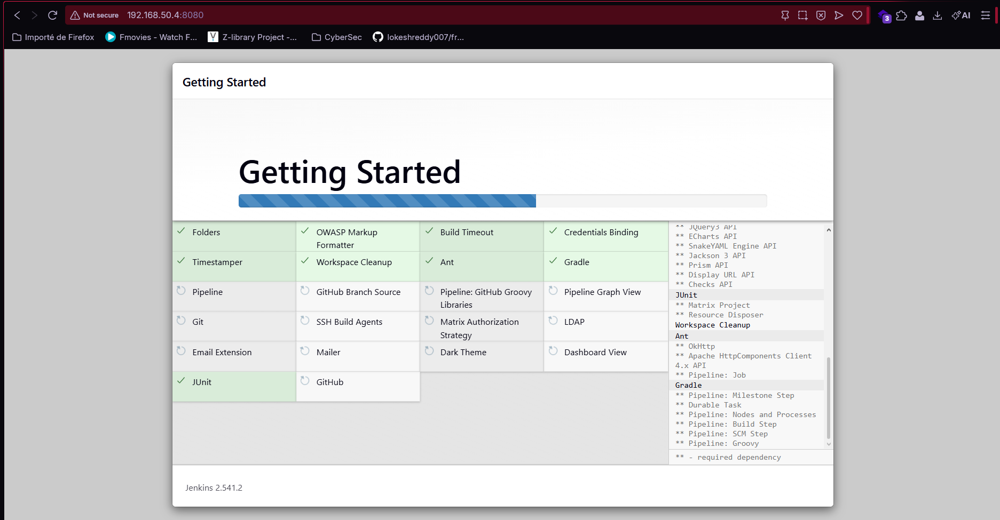

---

## Phase 2 — Conteneurisation (Docker)

Docker a été utilisé pour exécuter Jenkins et SonarQube en tant que conteneurs. Cela garantit une installation propre et une persistance des données via des volumes.

**Capture 4 — Conteneurs Docker en exécution :**
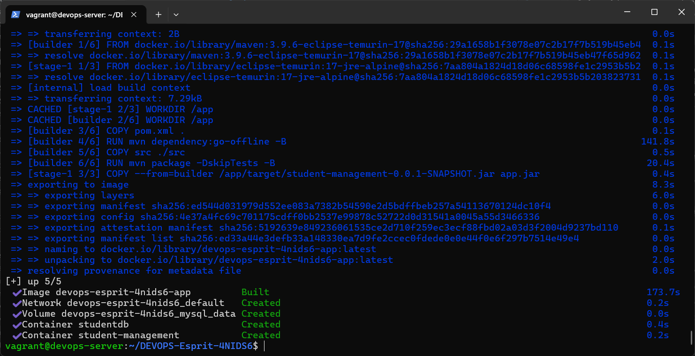

Le `Dockerfile` de l'application utilise un **build multi-étape** pour optimiser la taille de l'image finale (~150MB au lieu de 500MB).

---

## Phase 3 — Pipeline CI/CD (Jenkins)

Jenkins est le moteur qui orchestre toutes les étapes du pipeline. Il surveille GitHub et lance une construction dès qu'un changement est détecté.

**Capture 2 — Tableau de Bord Jenkins :**
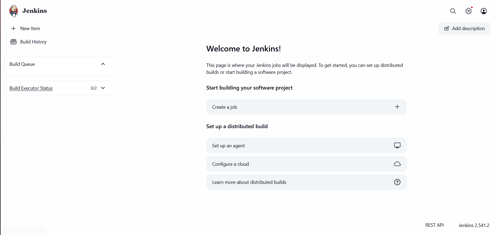

### Le Pipeline Jenkinsfile
Le pipeline contient 6 étapes clés : Préparation, Build & Test, Analyse SonarQube, Build & Push Docker, Mise à jour du Manifeste K8s, et Déploiement.

**Capture 8 — Pipeline Jenkins (Succès Complet) :**
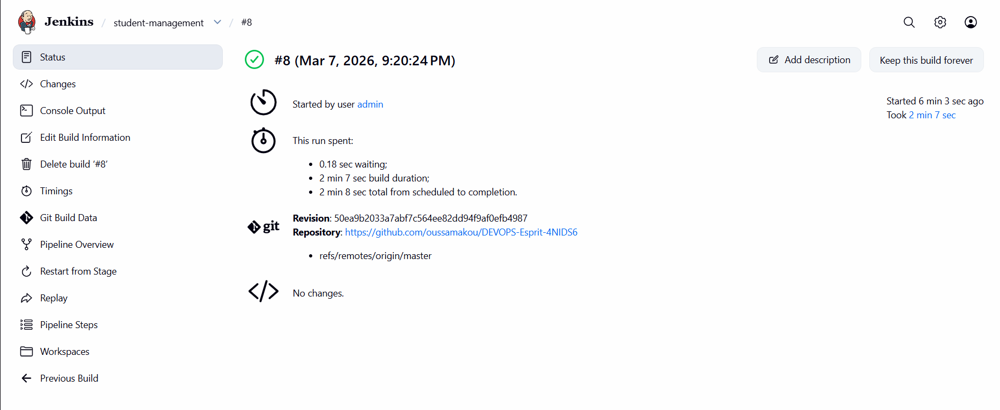

---

## Phase 4 — Qualité du Code (SonarQube)

SonarQube analyse le code pour détecter les bugs, les vulnérabilités et la duplication. Nous avons configuré **JaCoCo** pour mesurer la couverture de tests.

**Capture 3 — Interface SonarQube :**
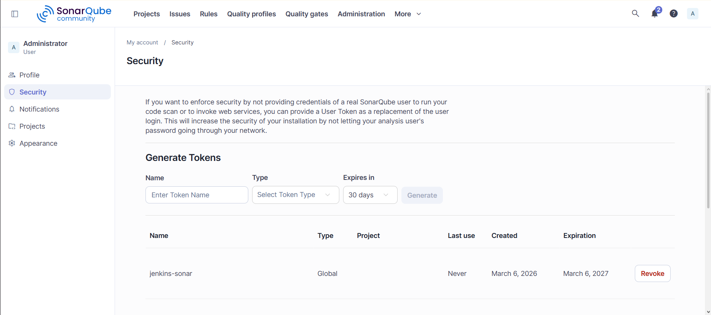

**Capture 5 — Couverture de Code SonarQube (29%) :**
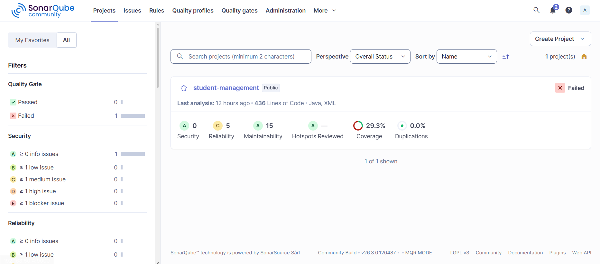

---

## Phase 5 — Déploiement Kubernetes (Minikube)

Nous avons installé Minikube pour simuler un environnement de production Kubernetes. Jenkins communique avec Minikube pour déployer l'image Docker de l'application et la base de données MySQL.

**Capture 6 — Lancement de Minikube :**
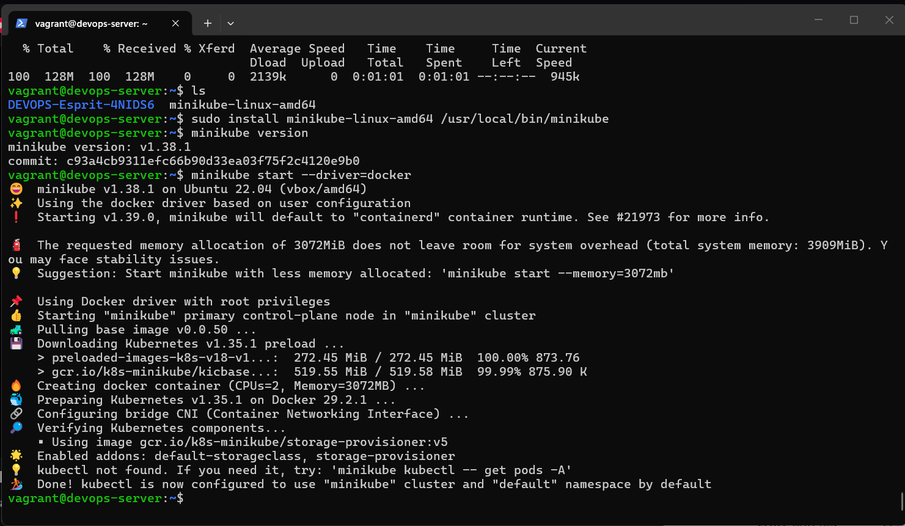

### Vérification du Cluster
Nous vérifions que les pods et les services sont bien en ligne.

**Capture 7 — État du Cluster Minikube :**
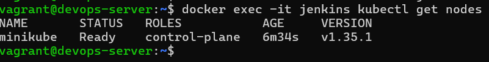

**Capture 9 — Liste des Pods (Running) :**
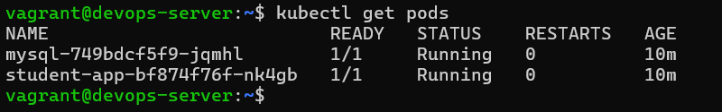

**Capture 10 — Liste des Services K8s :**
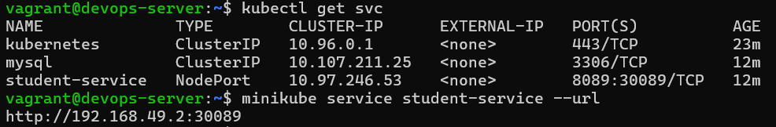

### Accès à l'Application (Swagger UI)
L'application est exposée sur le port `30089`.

**Capture 11 — Interface Swagger UI Fonctionnelle :**
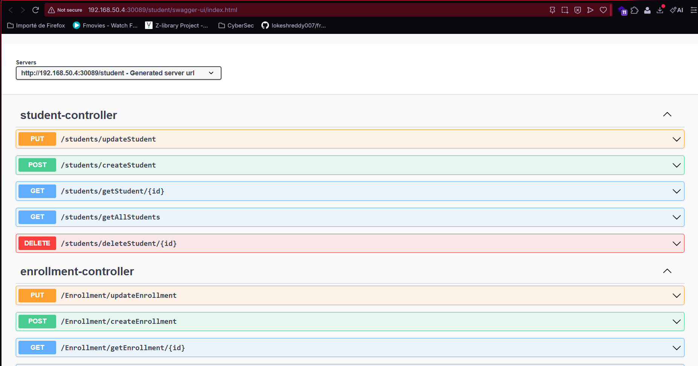

---

## Phase 6 — Lab Kubernetes Manuel

Pour démontrer la maîtrise des commandes `kubectl`, un pod Nginx a été lancé manuellement dans le cluster.

```bash
kubectl run oussa-lab --image=nginx
kubectl get pods
```

---

## Problèmes Rencontrés & Solutions

| Problème                 | Cause                     | Solution                                                |
| ------------------------ | ------------------------- | ------------------------------------------------------- |
| Connectivité Jenkins/K8s | Réseaux Docker différents | `docker network connect minikube jenkins`               |
| Échec du Push Docker     | Crédentiels erronés       | Utilisation d'un Token d'accès Docker Hub (PAT)         |
| Erreur de Tests          | Conflit avec MySQL        | Activation du profil `@ActiveProfiles("test")` avec H2  |
| Accès Swagger (Windows)  | IP Minikube interne       | Utilisation de `kubectl port-forward --address 0.0.0.0` |

---

## Architecture Finale

```text
GitHub Push ──▶ Jenkins ──▶ Build/Test ──▶ SonarQube ──▶ Image Docker ──▶ Docker Hub ──▶ Minikube (K8s) ──▶ Swagger UI
```
